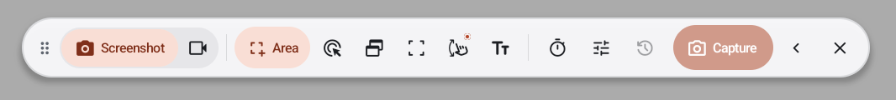
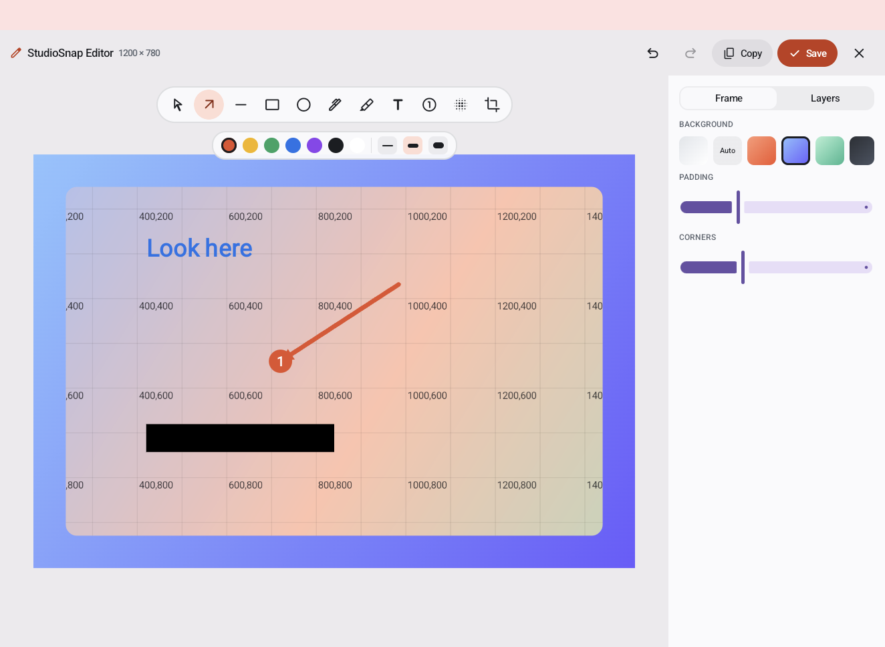
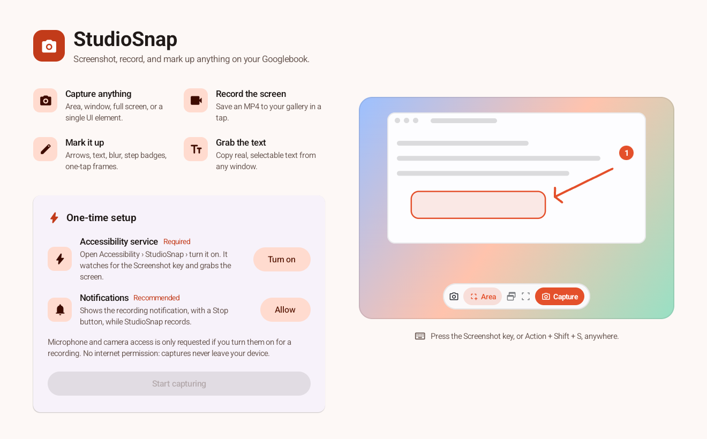
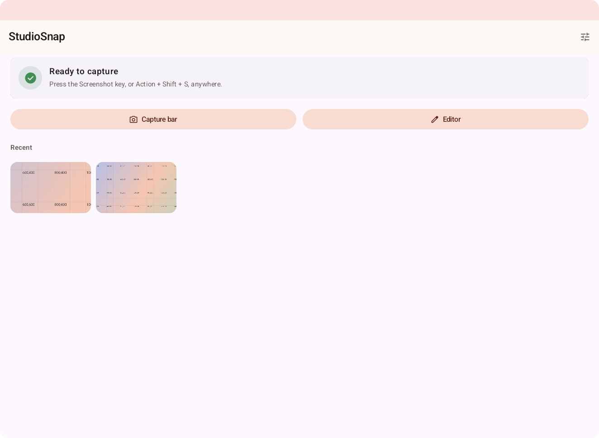
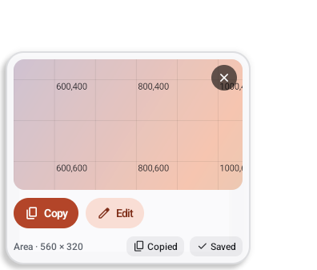

<div align="center">

# 📸 StudioSnap

### A capture studio for your Googlebook — screenshots, screen recording, and markup, all on-device.

Press one key. Grab an area, a window, a UI element, or a whole scrolling page.
It's **copied, saved, and ready to annotate** the instant you let go — and nothing ever leaves your laptop.


-success)


<a href="../../releases/latest/download/StudioSnap.apk"><b>⬇ Download StudioSnap.apk</b></a>
&nbsp;·&nbsp; <a href="#get-it">How to install</a>
&nbsp;·&nbsp; <a href="#privacy">Privacy</a>



</div>

---

## Why you'll like it

- 🎯 **Capture anything** — an **area**, a **window**, the **full screen**, a single **UI element**, or an entire **scrolling page**. A live loupe and colour picker help you nail the exact pixel.
- ⚡ **Instant** — hit the **Screenshot key** (or **Action + Shift + S**) anywhere. Your shot lands on the clipboard and in your gallery before you blink — no per-capture pop-up.
- ✏️ **Mark it up** — a real editor with arrows, shapes, pen, highlighter, text, numbered steps, blur/redaction and crop — plus **one-tap frames** that make any screenshot look designed.
- 🔤 **Grab the text** — copy selectable text out of any window, and **on-device OCR** reads text straight out of images, PDFs, and canvas apps.
- 🎥 **Record** — save a screen recording to an MP4 with a tap, with your voice from the mic and/or the sound your apps play, and a floating **camera bubble** of your face if you want one.
- 🔒 **Private by design** — 100% on-device with **no `INTERNET` permission**. Your captures, recordings, and OCR never touch a network.

## Mark it up



Annotate, blur the sensitive bits, drop numbered steps, then wrap it all in a colourful **frame** with adjustable padding and rounded corners — and Copy or Save.

## A look around



<table>
<tr>
<td width="62%"></td>
<td width="38%"></td>
</tr>
<tr>
<td align="center"><em>Home — status, quick actions, and recent captures</em></td>
<td align="center"><em>Every capture drops a card, ready to copy or edit</em></td>
</tr>
</table>

## Get it

StudioSnap is made for Googlebooks (Googlebook OS, Android 17).

1. On your Googlebook, download **[StudioSnap.apk](../../releases/latest/download/StudioSnap.apk)** from the latest release.
2. Open it from Chrome's downloads or the **Files** app. If Android asks, allow Chrome (or Files) to install apps, then tap **Install**.
3. Open **StudioSnap** and follow the one-time setup — it opens Accessibility settings so StudioSnap can watch for the Screenshot key and grab the screen. (It only listens for the hotkey; it never logs your keystrokes — see [Privacy](#privacy).)
4. **Because StudioSnap came from a download, Android guards this switch the first time:**
   1. Tap StudioSnap's switch in Accessibility. Android says *"Restricted setting."* Tap **OK**.
   2. Open StudioSnap's **App info**, tap **⋮** (top-right) › **Allow restricted settings**, and confirm with your PIN.
   3. Return to **Accessibility › StudioSnap** and turn it on.
5. Press the **Screenshot key** — or **Action + Shift + S** — anywhere to capture. 🎉

> **Heads-up:** about a day later Android may show *"Review app with full device access."* That's a standard check for **every** app that uses an accessibility service — keep StudioSnap if you're happy with what it does. It has no internet permission and only reads the screen when you capture.

To update, just install a newer `StudioSnap.apk` over the old one — your settings and captures stay.

## Using it

- In the floating bar, pick a **mode** (Screenshot / Record) and a **source**:
  **Area** (drag a box), **Sections** (click a UI element), **Window**, **Screen**, **Scroll** (full page — *beta*), or **Text**.
- In **Record** mode, the camera toggle shows a live **camera bubble** that's recorded with the screen. Drag it and it snaps to the nearest corner; hover over it to make it bigger, switch between a circle and a rounded square, or switch cameras when a webcam is plugged in. **Remove background** leaves just you (head and body) floating over the screen, with no box around you.
- The microphone and speaker toggles add your **voice** (a voice-over) and/or the **system audio** your apps play. Android asks for the microphone permission the first time. With both on, wear headphones so your speakers don't echo into the mic.
- After a capture, a card appears in the corner — **Copy** it again, hit **Edit** to open the editor, or dismiss it.
- In the editor, the **Frame** panel adds a background, padding and rounded corners; **Layers** lists everything you've drawn.

## Privacy

StudioSnap requests **no `INTERNET` permission** at all — screenshots, recordings, and OCR run entirely on your device and never reach a network. The accessibility service exists only to catch the capture hotkey and read the screen when you capture; it does not log or store your keystrokes or mouse. The **microphone** is used only while you record with the mic toggle on (Android asks you first and shows its mic indicator while it's in use). **System audio** captures only the sound your apps play, never the mic, though Android files it under the same microphone permission. The **camera** runs only while the camera bubble is on screen (Android shows its camera indicator), and its picture only ends up in recordings you make.

## Build from source

Requires the Android SDK (platform 37, build-tools 36) and JDK 21.

```bash
git clone https://github.com/kuscher/studiosnap
cd studiosnap
./gradlew :app:assembleRelease   # or :app:assembleDebug
```

Contributor notes and the project pickup guide live in [`CLAUDE.md`](CLAUDE.md) and [`docs/PICKING-UP.md`](docs/PICKING-UP.md).

## Disclaimer

StudioSnap is a **personal hobby project by Alexander Kuscher**, built in my own free time for fun. It is **not affiliated with, endorsed by, sponsored by, or connected to my employer** — or any other company — in any way, and nothing in this project should be read as an endorsement in either direction. All opinions, code, and design here are my own. Product and company names, including "Googlebook," are trademarks of their respective owners; this is an independent project and is not affiliated with or endorsed by them.

## License

[MIT](LICENSE) © 2026 Alexander Kuscher

Background removal uses Google's [MediaPipe Selfie Segmentation](https://storage.googleapis.com/mediapipe-assets/Model%20Card%20MediaPipe%20Selfie%20Segmentation.pdf) model (Apache License 2.0), bundled in the app and run on your device with [LiteRT](https://ai.google.dev/edge/litert).

<div align="center">

<sub>🖥️ Proudly designed, built, and tested <strong>entirely on a Googlebook</strong>.</sub>

</div>
